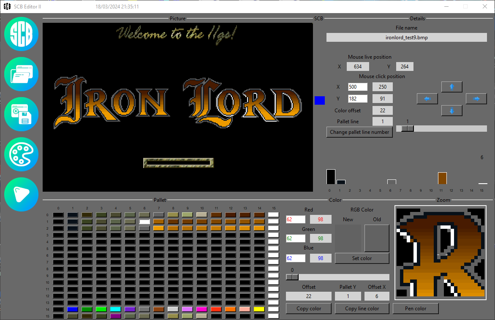
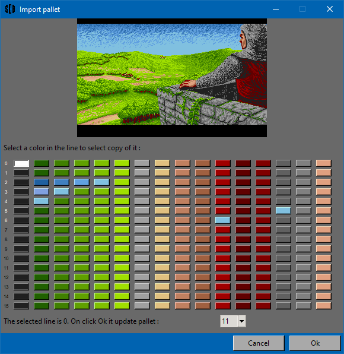
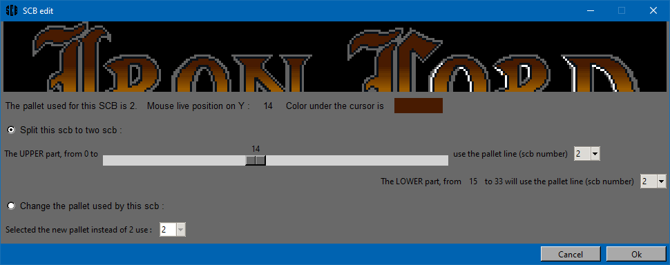

# **SCB Editor II - manuals**

&nbsp;

_Creation: March 2nd, 2024, by Renaud Malaval_  
_Last review: July 19th, 2025, by Renaud Malaval_  
_Version: 2.9.27.125_

&nbsp;

## Table of Contents

- [**SCB Editor II - manuals**](#scb-editor-ii---manuals)
  - [Table of Contents](#table-of-contents)
  - [Features](#features)
  - [Main window](#main-window)
    - [Left vertical icons bar](#left-vertical-icons-bar)
    - [Picture part](#picture-part)
      - [Under _Picture_](#under-picture)
      - [Under _SCB_](#under-scb)
      - [Under _Details_](#under-details)
    - [Pallet part](#pallet-part)
      - [Under _Pallet_](#under-pallet)
      - [Under _Color_](#under-color)
      - [Under _Zoom_](#under-zoom)

&nbsp;

## Features

:warning: Before usage of **SCB Editor II**, make a backup of your bmp files!

The goal of **SCB Editor II** is to prepare a .bmp file to be converted to .pic file for Apple IIGS.
The bmp file is directly converted to be compatible with **SCB Editor II**.  
A bmp 4 bits / pixels is converted to bmp 8 bits / pixels, the 16 colors pallet is copied 15 times to fill the 256 colors pallet.  
Supported picture:  
  have 320 x 200 pixels size.  
  have a maximimun of 16 colors per line.  
You see the pallet used in your picture (number is in white)
You could modify, copy color in the pallet.  
You could copy a line of color to an another line.  
You could change color of a pattern in zoom.  
You could set a SCB to a line of color to increase the number of color used.  
You could import pallet from an another image.  
You could scb edit, split a group of picture line.  

## Main window

| Icon commands | Parts                 |
|:-------------:|:---------------------:|
| A             | Picture, SCB, Details |
|               | Pallet, Color, Zoom   |

### Left vertical icons bar

From the up icon to the down:  
  1 - About  
  2 - Load picture  
  3 - Save picture  
  4 - Import from an another picture a 16 colors pallet  

  5 - Set color reserved for cursor **Not implemented**  

### Picture part

#### Under _Picture_

Display the loaded picture, zoomed by 2.  
Automatic click on the middle of the picture update all the interfaces.

#### Under _SCB_

Display blue rectangle(s) to indicate the number of line using the same pallet.  
For a bmp with bmp 4 bits or 8 bis / pixels the column is completely blue. We use only 16 colors just one pallet.  
Click on it to modify a group of line using the same pallet.  
You could cut it in two part group to use two pallet or to change the pallet of this group.  

#### Under _Details_

**File name**
  The name of the picture loaded

**Mouse live position**
  **X** and **Y** are the cursor position.

**4 blue arrows** button
  To roll the picture to up, down, left and right.
  
**Mouse click position**
  **X** and **Y** are the cursor position on the mouse click (value for zoomed picture and not zoomed).

**4 blue arrows** button
  To move the cursors simply, like the mouse.

**Color offset**
  The offset of the color in the 256 colors pallet. Like field **Offset** below.

**Pallet line**
  Is where the **Color offset** is in the 256 colors pallet. Its 16 pallet of 16 colors and set in the scroll bar.  
  You could move the scroll bar to set a new pallet line; you change the **SCB** value for the **Pallet line** by click on button **Change pallet line number**.  
  Like field **Pallet Y** below.

**Change pallet line number** button
  Modify **Pallet line** by using the **Pallet line** value, set a new **SCB** value.

**Histogram**
  Display the number of colors are used in a line.  
  This indicates the color free to be used.  
  An empty column indicate a color is not used, 0 usage.  
  The number displayed on a column indicate usage less than 10 (1 to 9).

### Pallet part

#### Under _Pallet_

  The first column is the pallet number and become white when it is used.  
  The 256 colors are check box colors.  
  Each line is a pallet (after converted in .pic image).  
  Click on one of this check box update the interfaces.

#### Under _Color_

  **Red**
    Color value is hexadecimal and decimal values.
  **Green**
    Color value is hexadecimal and decimal values.
  **Blue**
    Color value is hexadecimal and decimal values.

  Click on one of the entry field to be able to modify it with the scroll bar.

  **RGB Color**
    **New field**
      The color change when you modify **Red**, **Green**, **Blue** values.
    **Old** button
      Reverse change done in selected color.
    **Set color** button
      Validate the change done.

  **Offset**
    The offset is the color in the 256 colors pallet. Like field **Color offset** above.
  **Pallet Y**
    The is number of the line. Like field **Pallet line** above.
  **Offset X**
    The index is the line.

  **Copy color** button
    Click on it to remember the color selected. Click one off the pallet radio button to change it.

  **Swap color** button
    Click on it to remember the color selected. Click one off the pallet radio button to swap value of it.

  **Copy line color** button
    Click on it to remember the color line selected. Click one off the pallet radio button to change it.

#### Under _Zoom_

  The picture zoomed by 8.  
  Use the **4 arrows** button to select a pixel.  
  Click on it is only need after a click on **Pen color**.

  **Pen color** button
    Click on it to remember the color selected. After click on the zoomed picture to change the pixels with the same color around the cursor "_ _".
