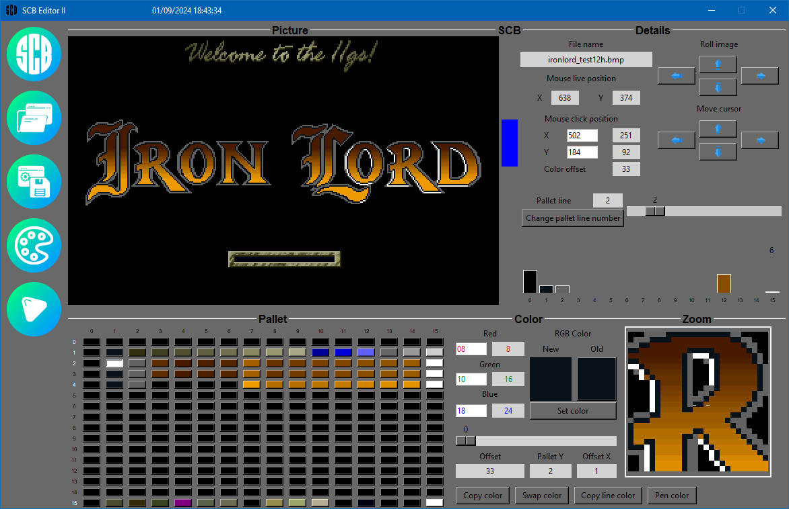

# **SCB Editor II**

_Creation: December 31th, 2023..2024, by Renaud Malaval_  
_Last review: September 6th, 2024, by Renaud Malaval_

## Features

  This is an application to do modification of bmp file to prepare convertion to Apple IIGS pic format file.
  The goal is to increase the number of color used in your pic files with usage of **SCB**.
  This is an help for cross-dev on Linux (Debian and Red Hat package), MAC OS Catalina, Windows 10.
  BMP file supported are 4 (converted to 8) and 8 bits / per pixels.
  When your bmp files is ready you could convert it with [convm](https://github.com/Malaval-Ren/ConvM)
 
  :warning: Before usage of **SCB Editor II**, make a backup of your bmp files!

> note : My first release was on Apple IIGS **S.C.B. Editor** version 1.5a
> You could found it in the image scbeditor.img.
> Pascal source code is loozed.

## **Documentations**

- [Software overview](Documents/manual.md)
- [Files overview](Documents/Catalog_Files.md)

## **Versions**

- [Quality repport](Quality_pylint_log.md)

## **Notes**

- Windows 10 :
:warning:Microsoft Defender found **PUA:Win32/Packunwan** but I think that is an error  
Clamav, Malwarebytes, RogueKiller and Trellix don't found it on the exe file and on my hard drive  
Please, check it before install it, svp  
If your antivirus find some think, send me a mail, please  

- Linux Mint :
The Debian package .deb is created on Linux Mint Virginia (v21.3)  
The Red Hat package .rpm is converted by [Alien](https://joeyh.name/code/alien/) (I don't have access to this Linux version, not tested)  

 - Mac OSx86 : 
[Homebrew](https://brew.sh/)

- Create Release :
A complete release could be created with "Delivery.sh"  
I'm using it currently for internal usage and testing  
I have to create an ".venv" environment to simplify it  

## **Tools**

- [Python](https://www.python.org/) with Tcl/Tk
  - Windows 10 : 3.12.5
  - [Linux Mint](https://linuxmint.com/) : default release installed with your distribution (min 3.10.12)  
  - [Mac OSx86 10.15.7](https://apps.apple.com/fr/app/macos-catalina/id1466841314?mt=12) : 3.12.2
- [Python modules](https://pypi.org/)
  - [pip](https://pypi.org/project/pip/)
  - [pillow](https://pypi.org/project/pillow/)
  - [pyinstaller](https://pyinstaller.org/en/stable/)
  - [pylance](https://pypi.org/project/pylance/)
- [Visual Studio Code](https://code.visualstudio.com/) : IDE (with somes extensions)
- [Mark Text](https://www.marktext.cc/) : A viewer for markdown file (.md)
- [GIT](https://git-scm.com/) : Distributed version control system
- [Sourcetree](https://sourcetreeapp.com/) : A beautiful Git GUI
- [Inno Setup](https://jrsoftware.org/isinfo.php) : Create on an installor for Windows
- [7-Zip](https://www.7-zip.org/) : A file archiver
- [GIMP](https://www.gimp.org/) : A picture editor
- [Image Magick Display](https://imagemagick.org/) : To convert .png to .icns
- [XnView](https://www.xnview.com/) : To view .icns Mac Os icon file on Windows 10
- [FlatIcon](https://www.flaticon.com) : Source of wonderful free pictures
